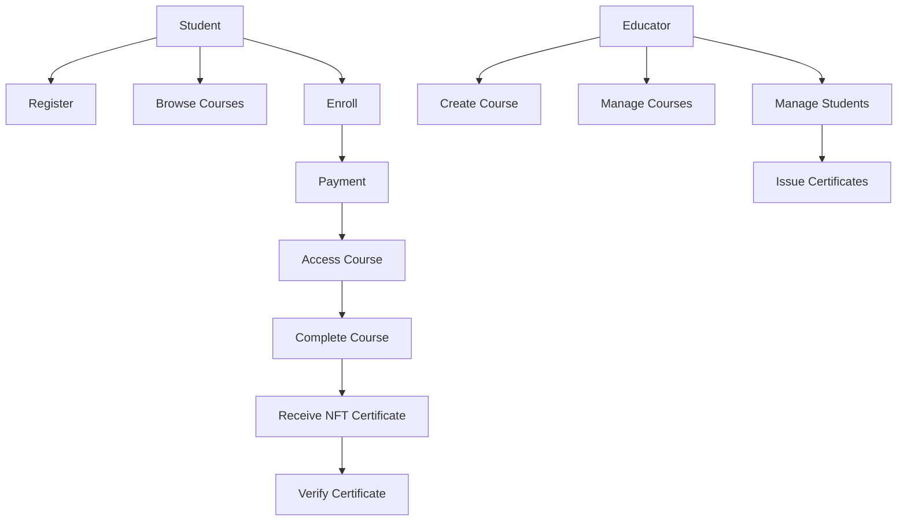

# Cardano UTC – Blockchain Learning Management System

## About Cardano UTC

Cardano UTC (CAUTC) is a next-generation learning management system integrating blockchain technology into education.  
Built on the Cardano blockchain, it provides a **secure, transparent, and immutable** method for issuing and verifying educational certificates in the form of NFTs.

This platform bridges the gap between traditional e-learning and Web3 innovation, empowering both students and educators with trustless, verifiable credentials.

---

## Key Features

### For Students

- Discover and enroll in courses using advanced search filters
- Pay using **ADA cryptocurrency** or **PayPal**
- Earn NFT certificates with on-chain verification
- Track progress and engage with interactive learning modules

### For Educators

- Create, manage, and publish courses with ease
- View student analytics and performance reports
- Issue blockchain-based certificates
- Unlock premium tools for advanced teaching features

---

## Functional Flow

